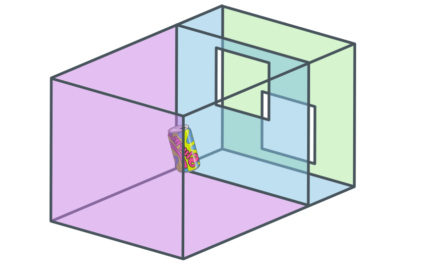
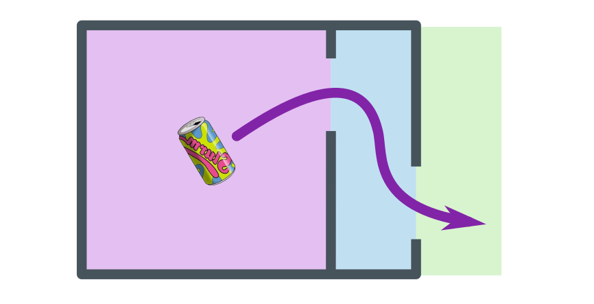
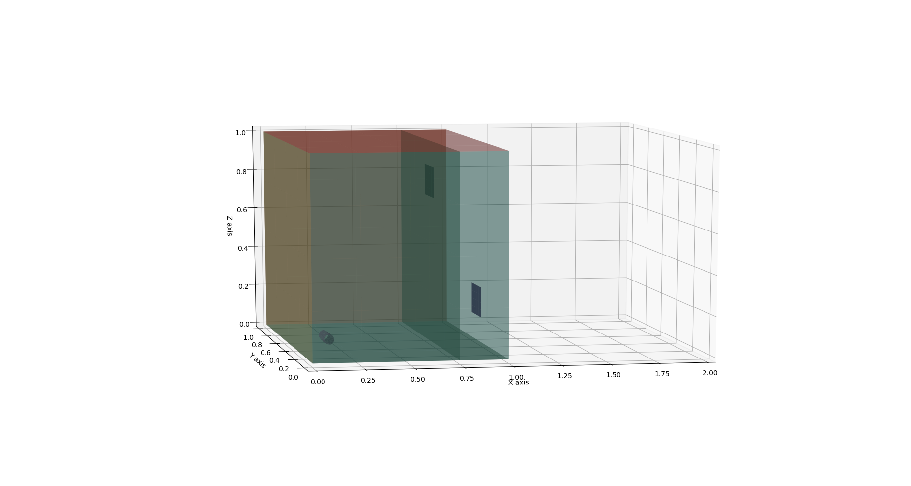
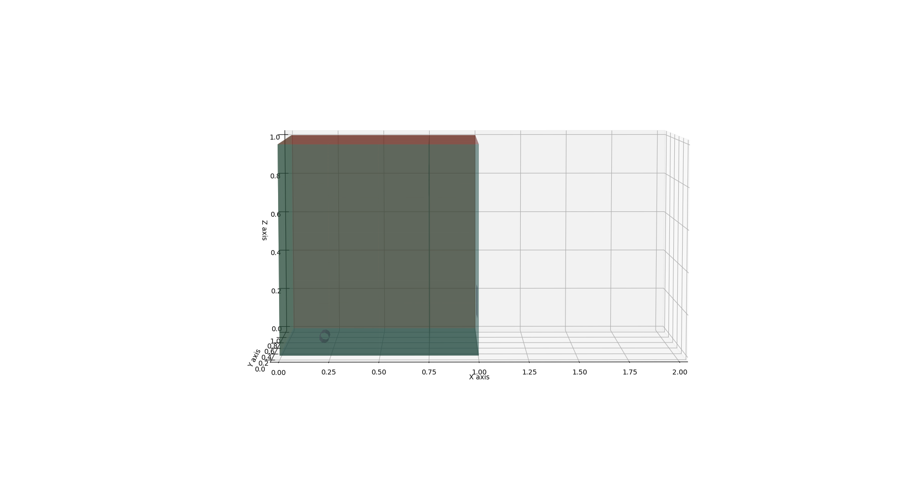
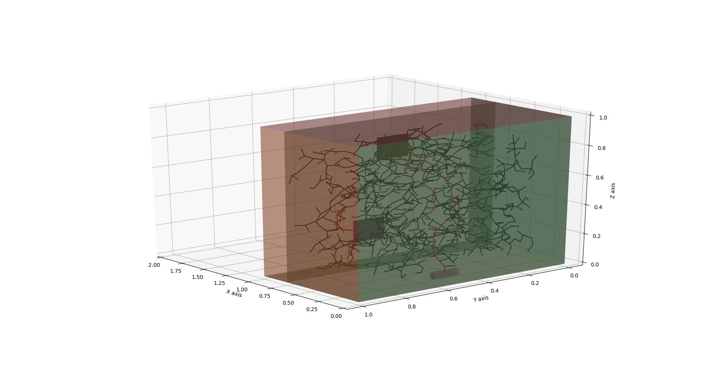
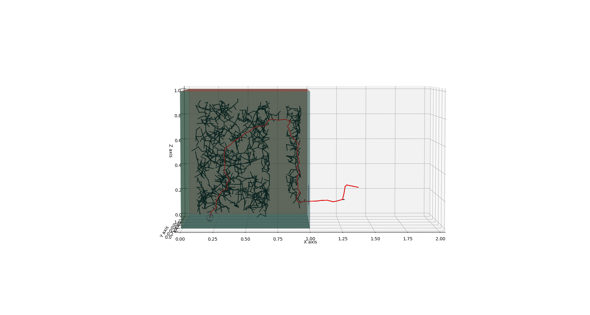
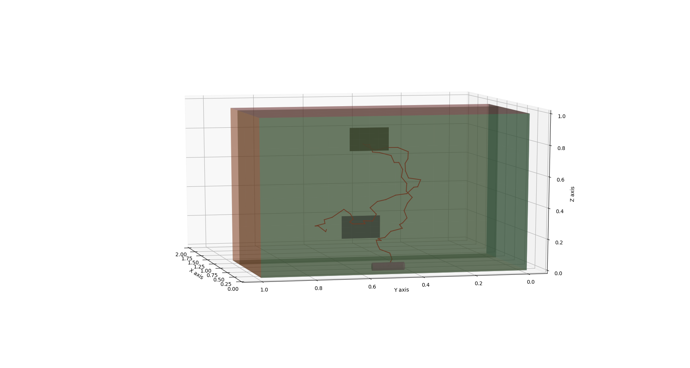
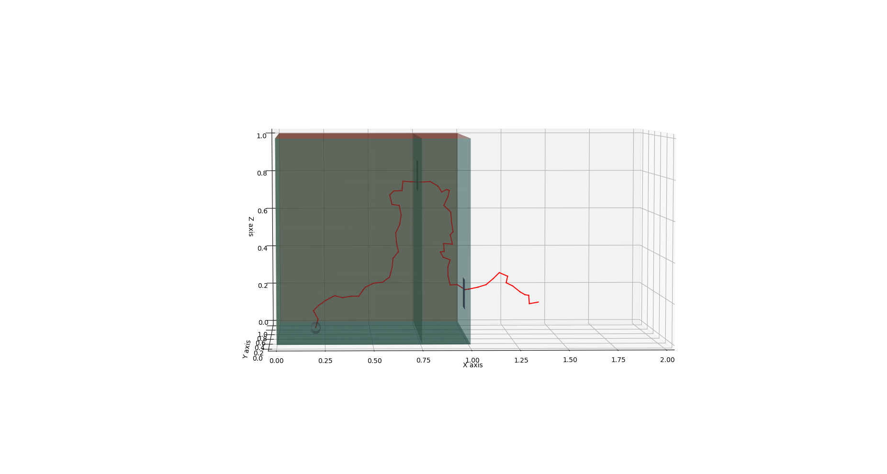

# Rapidly Exploring Random Tree in 3D.

Implementation of RRT to perform the below stated task.

## Problem Statement

The soda can starts trapped inside a chamber in the vending machine, and must be maneuvered past
two barriers to get outside.
## Environment

The environment consists of the vending machine interior, with the main chamber and two barriers
connected. Each barrier has a window, just barely large enough to fit a soda can. These windows
are misaligned, as an anti-theft measure that must be defeated.

The soda can is a standard 12 oz. aluminum beverage can, modeled as a perfect cylinder with
a diameter of 52 mm and height of 122 mm. The main chamber of the vending machine is a cube 1
meter on a side. The first barrier is on the far wall, with an opening with its center 200 mm from
the top. The second barrier is offset 250 mm from the first, with an opening with its center 200 mm
from the bottom. Both windows are squares, 150 mm on a side, and aligned with the centerline of
the inner chamber, along the axis normal to the barriers.

3D view of the world                      |  Side view of the world
:----------------------------------------:|:-------------------------:
  |  

## Codes
1. main.py     - The main python file, which calls the functions.
2. world.py    - This files creates the 3D environment using matplotlib.
3. cylinder.py - This file creates the cylindrical can, which needs to be maneuvered in the environment.
4. RRT_3D.py   - Algorithm for RRT in 3D.

## Images
### Images of the developed world environment.

3D view of the world                                 |  Side view of the world
:---------------------------------------------------:|:-------------------------:
  |  

### Images of the Rapidly Exploring Random Tree.

RRT front view                                       |  RRT side view 
:---------------------------------------------------:|:-------------------------:
    |  

### Images of the final path.

Final path from front view                           |  Final path from side view 
:---------------------------------------------------:|:-------------------------:
    |  

## Demonstration

https://user-images.githubusercontent.com/30457807/150585041-44ebf120-e1d6-4c11-a011-6bf2f4c71f77.mp4

